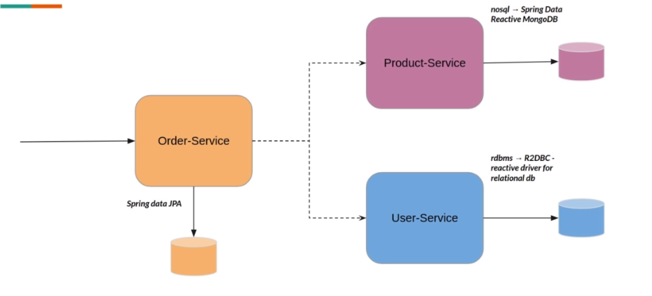

# Reactive Microservices with Spring Boot 3.2.x

## Services

- Product service (reactive web, reactive mongodb)
- User service (R2DBC)
  * dev environment with H2
  * prod environment with postgres
- Order service (JPA) blocking - will use some reactive techniques to mitigate the blocking effect

## Architecture

